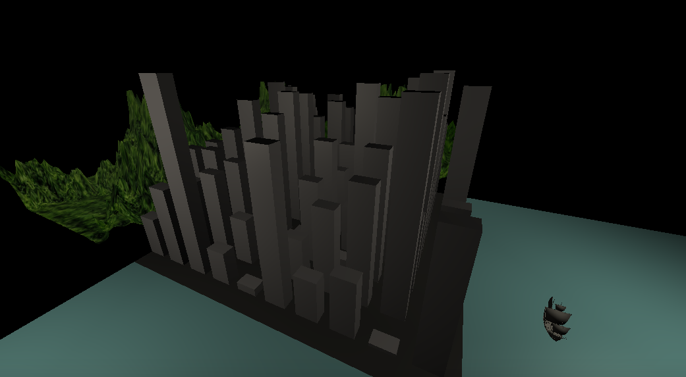
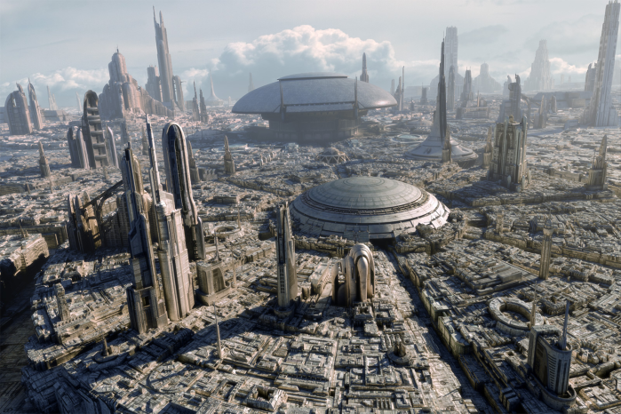
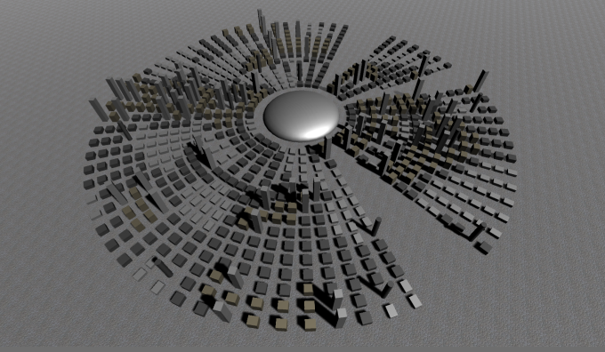
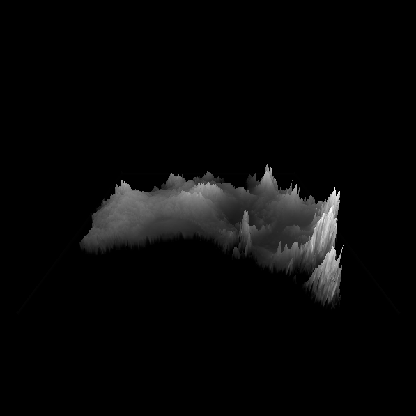
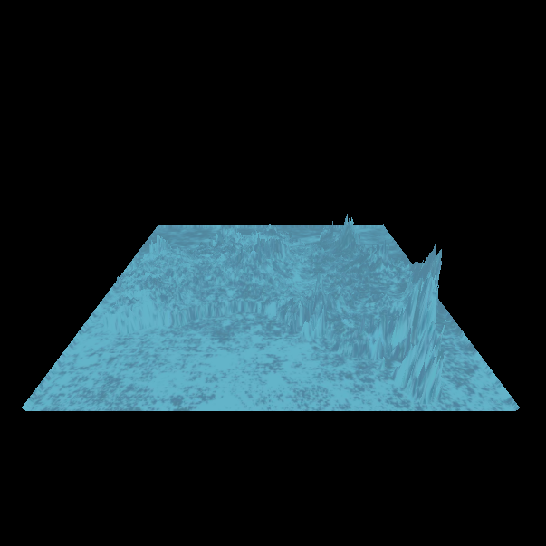
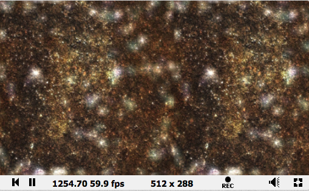

# CMPM163Labs

-lab8

i. 

2. 

3. Based on the picture, I added the mountain behind the city and ocean besides the city.
   I also added a boat to reminiscent the city signature junk boat(couldn't find free model of junk boat, hehe).

My Partner Repsonse:
"The way I did it was that instead of arranging the buildings in a grid using x and y, I arranged them in circles with r (radius) and d (degrees)
d increments by 5-10 degrees per building, and then rotates them by that amount so that they're facing the center"
    
-------------------------------------
-lab7
A.   
      

2. https://drive.google.com/file/d/1ZaRTYNyMSxbOeZs79oI3t4XJ1JFV3jk5/view?usp=sharing

3. https://drive.google.com/file/d/1QtOgFIz5FXJHiDObidxjA32SRQuhiCDj/view?usp=sharing

-Which part did my partner do?

    I did part 1.
-Which part of a tutorial did your partner find most challenging?

    Step 6 where you need to import more models&materials. As it is not clear in the handout that using the universal rendering
    pipeline would cause problems with custom shaders, it was really hard for me to import one into the scene.
-Which part of a tutorial did your partner find most interesting?

    Step 4 where you get to make a wave with only the shader. It was epic.
    
-------------------------------------
-lab6
1. 

2. https://www.shadertoy.com/view/wdfBDl

3. https://www.shadertoy.com/view/3slcWr
-------------------------------------
-lab5

a.) video link: https://drive.google.com/open?id=1T-nAFOFCe2oApHi9cXM11thiliPizI3G

b.) video link: https://drive.google.com/open?id=1iWmPXbM32jE_ijNjCislKdPg0W4amIWP

c.) video link: https://drive.google.com/open?id=1mtVjJbnUz8QSFJRKRBhVM86FYKX5jXjb

I made my custom scene by combining the techinque we learned from part a and part b. 
I first used the part a technique, replace the texture with a cloud picture. 
And add the particle with rain drop texture, and changed the velocity downwards.

-------------------------------------
-lab4

Answers:
24 a.) x = u * (width of texture)

   b.) y = (height of texture) - v * (height of texture)
   
   c.) x = 0.375 * 8 = 3
       y = 8 - (0.25 * 8) = 6
       (3, 6), which is a white grid.
       

video link: https://drive.google.com/file/d/1L0O49qEahsB8Kn-4NYQjwX0nJak6loJa/view?usp=sharing

1. The first cube is the leftmost one. I first created a mesh, and I apply a texture on its surface.
2. The second cube is the middle one. After I created the mesh, I apply the texture on its surface and the normal at last. 
3. The thrid cube is the rightmost one. I repeated the process from the second cube, but using a new texture & normal.
4. The forth one is the downmost one. Instead of using the built in material attributes, I wrote a shader to apply texture
   on the mesh.
5. The last cube is the upmost one. I repeated the same process from the forth cube. I did the tiling by mutiplying the 
   the uv coordinates by 3 and applied modulo (by 0.5).

-------------------------------------
-lab3

video link: https://drive.google.com/file/d/1KMBJpjPNrFZP9a-H9bvyScomGrOxq47O/view?usp=sharing

1. I made the first cube by creating a cube and adding phong material (green) on it
2. It's similar to the first one, but instead of using phong material, I used lambert material (blue).
3. I first created a vertx shader and a fragment shader file for coloring. then, made variables and
   loader code. Lastly, created the function to build the cube and add animation.
4. The process is similar to (3), but the colors are changed.

-------------------------------------
-lab2

part 1 video link: https://drive.google.com/open?id=1lYS7XkilJ2G4QZed1QMRvOKfkb292tng

part 2

-------------------------------------
